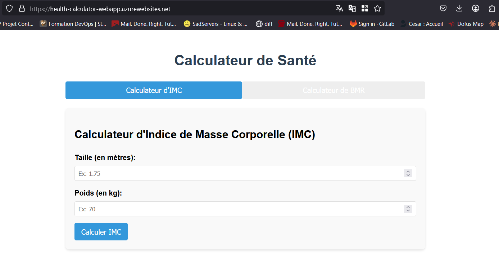
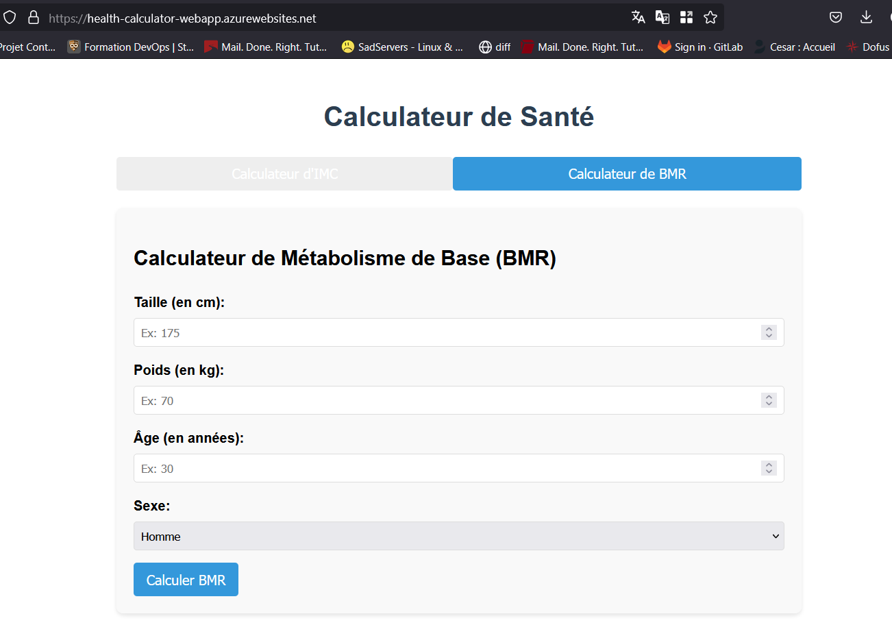

# 🌟 Health Calculator Microservice


## 🚀 Overview

This Health Calculator Microservice is a modern, containerized application that provides accurate health metrics calculations through a clean, REST API interface. The service calculates Body Mass Index (BMI) and Basal Metabolic Rate (BMR) using scientifically validated formulas.

Visit the live application: [Health Calculator App](https://health-calculator-webapp.azurewebsites.net)

## 💻 User Interface

Our health calculator offers an intuitive, user-friendly interface for calculating important health metrics without needing to interact directly with the API.

### BMI Calculator


The BMI calculator allows users to:
- Enter their height in meters
- Enter their weight in kilograms
- Instantly view their BMI value
- See which category their BMI falls into (Underweight, Normal weight, Overweight, or Obese)

### BMR Calculator


The BMR calculator provides:
- Input fields for height (in centimeters), weight (in kilograms), and age
- Gender selection (male/female)
- Calculation of daily caloric needs at rest
- Clear explanation of what the BMR value represents

## ✨ Features

- **🏋️‍♀️ BMI Calculation**: Calculate Body Mass Index with accurate categorization
- **🔥 BMR Calculation**: Determine Basal Metabolic Rate using the Harris-Benedict equation
- **🌐 RESTful API**: Well-designed API endpoints with comprehensive error handling
- **📊 Interactive UI**: User-friendly web interface for easy calculations
- **🔒 Input Validation**: Robust validation of all user inputs
- **📝 Detailed Logging**: Comprehensive logging for monitoring and debugging
- **🧪 Unit Testing**: Thorough test coverage for all calculation functions
- **🐳 Containerization**: Fully dockerized for consistent deployment
- **🚀 CI/CD Pipeline**: Automated testing and deployment with GitHub Actions

## 🧮 Health Formulas Implemented

### Body Mass Index (BMI)

BMI is calculated using the formula:

```
BMI = weight (kg) / (height (m))²
```

### Basal Metabolic Rate (BMR)

BMR is calculated using the Harris-Benedict equation:

**For males:**
```
BMR = 88.362 + (13.397 × weight in kg) + (4.799 × height in cm) - (5.677 × age in years)
```

**For females:**
```
BMR = 447.593 + (9.247 × weight in kg) + (3.098 × height in cm) - (4.330 × age in years)
```

## 🛠️ Technology Stack

- **Backend**: Python 3.9, Flask 2.0.2
- **Containerization**: Docker
- **Testing**: Unittest
- **CI/CD**: GitHub Actions
- **Cloud Deployment**: Azure App Service
- **Container Registry**: Azure Container Registry
- **Frontend**: HTML, CSS, JavaScript

## 📋 API Documentation

### Root Endpoint

**URL**: `/`  
**Method**: `GET`

**Success Response**:
Returns an HTML interface with input forms for calculating BMI and BMR.

### BMI Endpoint

**URL**: `/bmi`  
**Method**: `POST`  
**Content-Type**: `application/json`

**Request Body**:
```json
{
  "height": 1.75,  // height in meters
  "weight": 70     // weight in kilograms
}
```

**Success Response**:
```json
{
  "bmi": 22.86,
  "category": "Normal weight"
}
```

### BMR Endpoint

**URL**: `/bmr`  
**Method**: `POST`  
**Content-Type**: `application/json`

**Request Body**:
```json
{
  "height": 175,      // height in centimeters
  "weight": 70,       // weight in kilograms
  "age": 30,          // age in years
  "gender": "male"    // "male" or "female"
}
```

**Success Response**:
```json
{
  "bmr": 1695.67,
  "unit": "calories/day"
}
```

## 🚀 Deployment

The application is deployed on Azure App Service using a continuous deployment pipeline. The process includes:

1. Automated testing on each push to the main branch
2. Building a Docker container image
3. Pushing the image to Azure Container Registry
4. Deploying the container to Azure App Service

## 🏗️ Architecture

```
┌─────────────────┐     ┌─────────────────┐     ┌─────────────────┐
│                 │     │                 │     │                 │
│  Client Browser │────▶│   Flask API     │────▶│  Health Utils   │
│                 │     │                 │     │                 │
└─────────────────┘     └─────────────────┘     └─────────────────┘
                              │
                              ▼
                        ┌─────────────────┐
                        │                 │
                        │     Logging     │
                        │                 │
                        └─────────────────┘
```

## ⚙️ Local Development

### Prerequisites

- Python 3.9+
- Docker
- Make (optional)

### Setup

1. Clone the repository:
   ```bash
   git clone https://github.com/yourusername/health-calculator-service.git
   cd health-calculator-service
   ```

2. Install dependencies:
   ```bash
   make init
   # or
   pip install -r requirements.txt
   ```

3. Run tests:
   ```bash
   make test
   # or
   python -m unittest test.py
   ```

4. Start the application:
   ```bash
   make run
   # or
   python app.py
   ```

5. Build and run with Docker:
   ```bash
   make build
   make docker-run
   # or
   docker build -t health-calculator-app .
   docker run -p 8000:8000 health-calculator-app
   ```